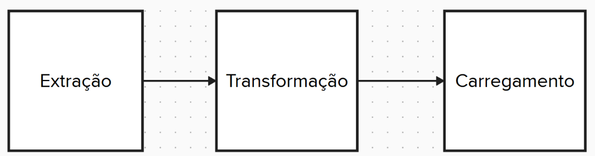

# Projeto ETL

**ETL** é um acrônimo para **Extract, Transform, Load** (Extração, Transformação e Carregamento).  
A proposta do projeto é processar duas tabelas (chamadas `order` e `orderItem`) disponibilizadas em arquivos CSV separados e transformá-las em três tabelas diferentes:

- **Faturamento Pedidos**
- **Média Meses**
- **Média Anos**

Além disso, o projeto possibilita **filtragem dos pedidos por origem ou status** antes de gerar as tabelas finais, permitindo focar em cenários específicos.

---

## Pipeline

Abaixo está a visão geral da pipeline do projeto:

### Extração

- Download dos dados via requisições HTTP  
- Armazenamento dos dados em registros  
- Captação de parâmetros de filtragem  

### Transformação

- Filtragem de dados  
- Agrupamento de dados  
- Manipulação de dados  

### Carregamento

Cria e preenche tabelas no SQLite:

- **Faturamento Pedidos** (informações de cada pedido e seus valores de faturamento e impostos)
- **Média Meses** (média de faturamento e impostos por mês)
- **Média Anos** (média de faturamento e impostos por ano)


---

## Metodologia

Para organizar o projeto, utilizou-se o **framework Dune**, que facilita a comunicação entre os arquivos de código-fonte e proporciona uma construção e execução eficientes, integrando facilmente as dependências necessárias.

As funções foram estruturadas de modo a manter separadas as **funções puras** das **funções impuras**:

- As funções **puras** (sem efeitos colaterais como I/O ou escrita em banco) estão em `pure.ml`.
- As funções **impuras** (operações de entrada/saída, requisições e acesso a banco) estão em `impure.ml`.

Todas as funções foram **documentadas detalhadamente por meio de Docstrings**, que incluem a descrição do que cada função faz, parâmetros de entrada e saída.

---

## Extração de Dados

A extração ocorre por meio de requisições HTTP para:

- `http://127.0.0.1:5000/order`
- `http://127.0.0.1:5000/order_item`

Cada requisição retorna o conteúdo do arquivo armazenado em uma única string. Essa string é então convertida em uma **lista de strings**, onde cada elemento corresponde a uma linha do CSV.  
Em seguida, **funções auxiliares (Helper Functions)** transformam essas linhas em listas de registros do tipo `Order` ou `OrderItem`, preparando os dados para uso posterior.

---

## Extração de Parâmetros de Filtragem

O usuário pode informar, via terminal, os filtros desejados para `status` e `origem`:

- **Status**: `Complete`, `Pending` ou `Cancelled`  
- **Origem**: `O` (Online) ou `P` (Physical)

Caso o usuário **não informe nada** ou informe **valores inválidos**, o parâmetro de filtragem será **nulo**, significando **nenhuma filtragem**.

---

## Transformação dos Dados

A transformação de dados envolve três etapas principais:

### 1. Filtração

- Mantém apenas pedidos cujo status e/ou origem correspondam aos parâmetros informados pelo usuário.  
- Se não houver parâmetros válidos, **todos os pedidos** são mantidos.

### 2. Agregação

- **Agregação por pedido**: Combina cada pedido com sua lista de itens, permitindo calcular o faturamento total e impostos.  
- **Agregação por período de tempo**: Agrupa os pedidos por **mês (YYYY-MM)** ou por **ano (YYYY)** para possibilitar o cálculo de médias mensais e anuais.

### 3. Manipulação

- Cálculo de **faturamento (valor total)** e **impostos pagos** de cada pedido.  
- Cálculo da **média de faturamento** e **média de impostos pagos** por mês e por ano.


---

## Carregamento dos Dados

Por fim, são criadas e preenchidas as seguintes tabelas em um banco de dados SQLite `etl.db`:

- **Faturamento Pedidos**: guarda o `id` do pedido, o faturamento total e o total de impostos pagos de cada pedido.
- **Média Meses**: armazena, para cada mês (formato `YYYY-MM`), a média de faturamento e de impostos por pedido.
- **Média Anos**: armazena, para cada ano (formato `YYYY`), a média de faturamento e de impostos por pedido.

> Vale ressaltar que **cada execução apaga a tabela anterior e cria outra nova**, ou seja, não há atualização de tabelas prévias.

---

## Exemplo de Uso

### Execução

1. Rode o servidor Python:  
   ```bash
   python3 /servidor_csv/server.py
   ```

2. Compile o projeto usando Dune:  
   ```bash
   dune build
   ```

3. Rode o executável gerado:  
   ```bash
   dune exec Projeto_ETL
   ```

### Interação

O programa solicitará filtros de `status` e `origem`:

- Digite: `complete`, `pending` ou `cancelled` para **status**  
- Digite: `o` ou `p` para **origem**  
- Pressione Enter ou qualquer outro input caso **não deseje filtrar**

### Resultado

Criação de um arquivo `etl.db` contendo as tabelas:

- `faturamento_pedidos`
- `média_meses`
- `média_anos`

Acesse a database:

```bash
sqlite3 etl.db
```

Veja as tabelas criadas:

```sql
.tables
```

Cheque os resultados:

```sql
SELECT * FROM faturamento_pedidos;
SELECT * FROM média_meses;
SELECT * FROM média_anos;
```

---

## Uso de AI

O projeto utilizou **IA** para:

- Criar a **estrutura do Dune**
- Verificar exemplos funcionais das bibliotecas usadas como SQLite, CSV e CURL
- Exemplos de como usar um Dicionário `Map(String)`
- Deixar os **comentários e o texto do relatório mais claros e objetivos**
- Explicar o funcionamento de **Docstring**
- Em alguns casos, **sugerir entradas e saídas para funções** (ex: `join` ter uma tupla como saída)
